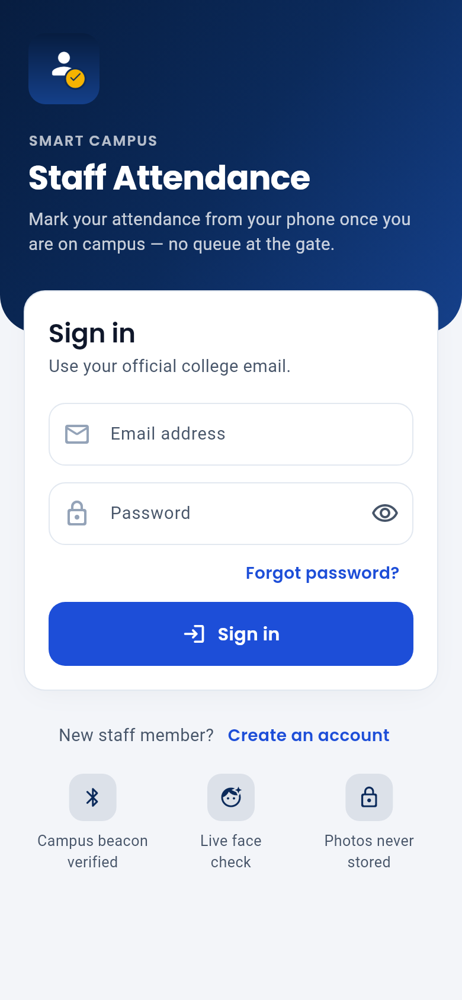
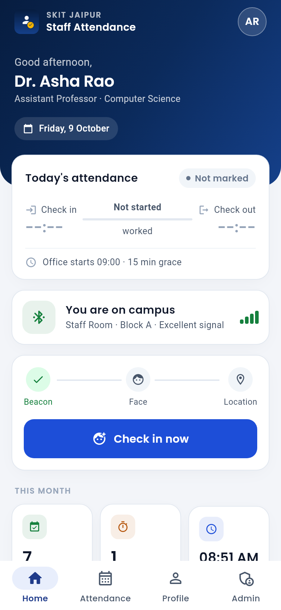
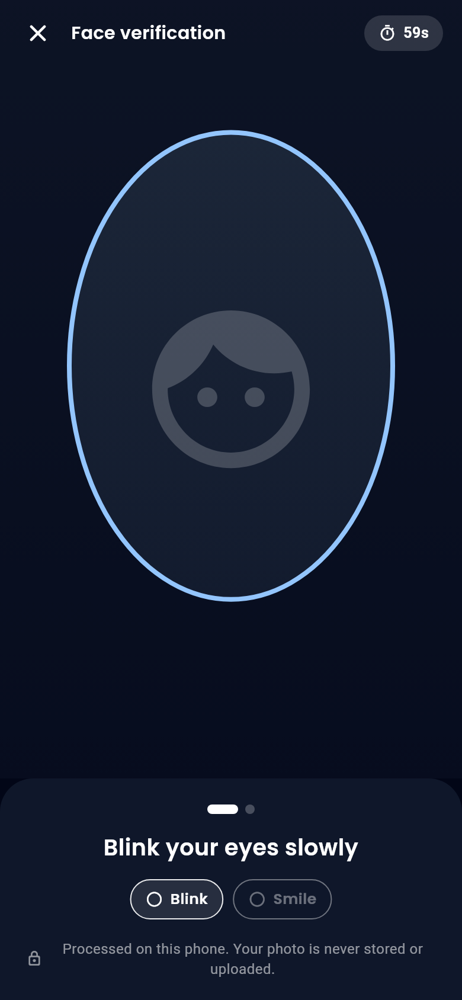
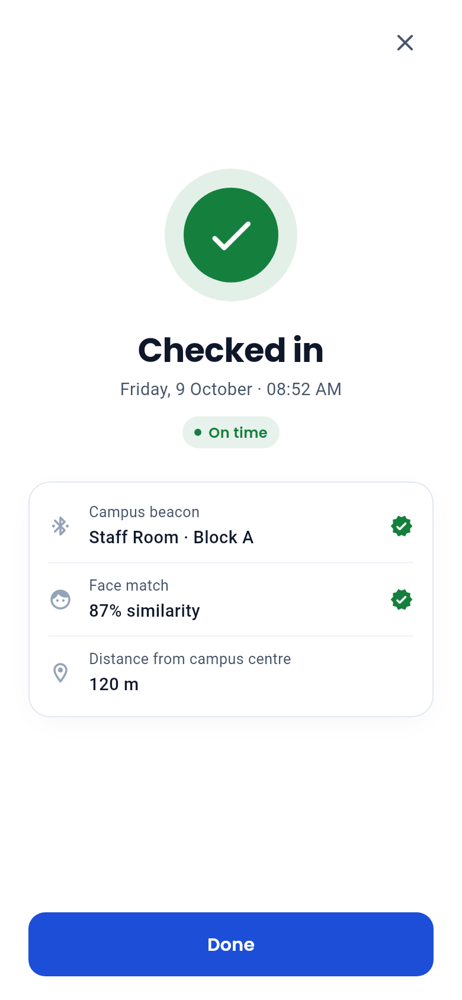
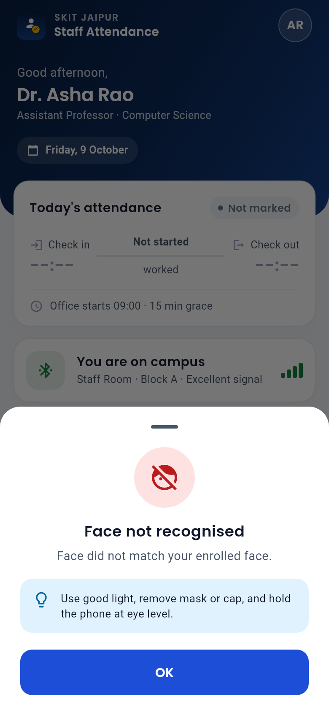
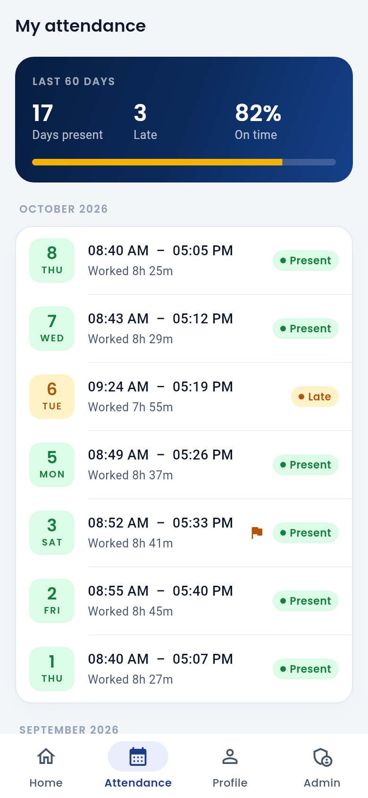
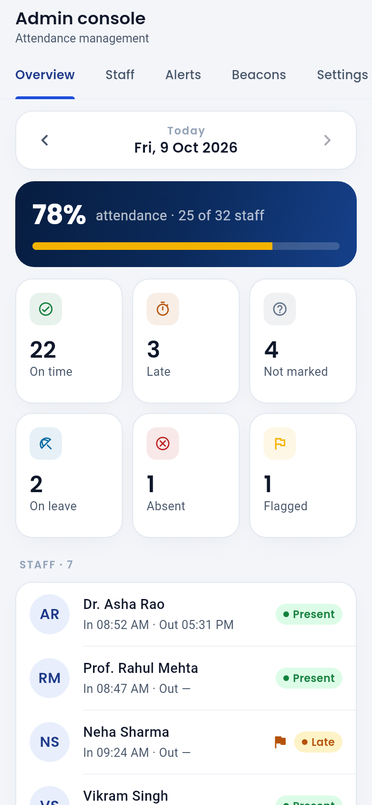
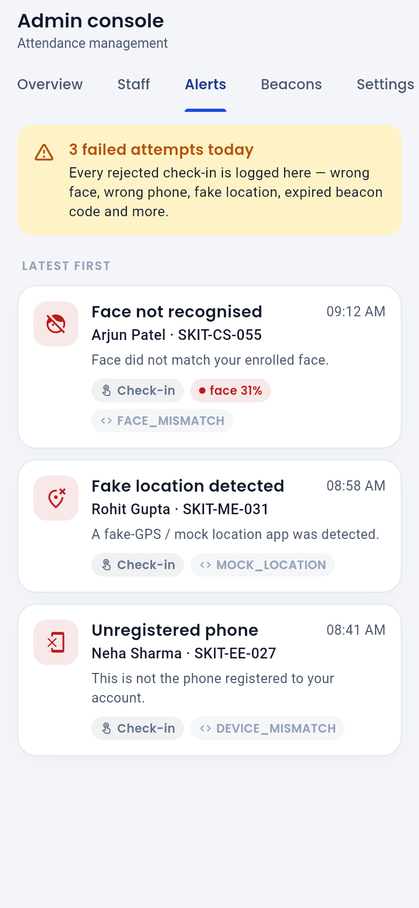

# Smart Campus Staff Attendance (PS 23 · SKIT023)

Staff mark attendance **from their own phone once they are on campus**, so
nobody has to queue at the main gate. A phone can only mark attendance when:

1. it is **near an ESP32 campus beacon** (BLE, token rotates every 30 s),
2. the **live camera** sees the right person doing **random liveness steps**
   (blink / smile / turn head). Face recognition runs **on the phone**: only a
   192-number face signature is sent, never the photo, and there is no gallery access,
3. it is the staff member's **own bound phone**, and
4. its **GPS** is inside the campus radius (configurable: off / flag / enforce),
   with fake-GPS detection.

The backend checks every signal. Every failed attempt is logged for the
admin as a possible proxy attempt.

> **Security notice.** The previous student-attendance version of this repo
> committed a live Supabase *service-role* key, JWT secret and MQTT password to
> this public repository, plus demo-account passwords. **Treat them as compromised:**
> rotate them, or better, create a fresh Supabase project and HiveMQ account.
> They are still in git history.

## Screenshots

| Sign in | Home (on campus) | Face verification | Checked in |
|:-:|:-:|:-:|:-:|
|  |  |  |  |
| **Rejected (proxy attempt)** | **Attendance history** | **Admin overview** | **Proxy alerts** |
|  |  |  |  |

All 15 screens are in [`docs/screenshots/`](docs/screenshots). They are rendered from the real
widgets with sample data (`flutter test --tags screenshots --run-skipped --update-goldens`).

## Repository layout

```
mobile/      Flutter app (Android): staff + admin screens
backend/     FastAPI API (Supabase service role), tests
firmware/    ESP32 beacon (PlatformIO / Arduino IDE)
supabase/    Database schema (migration), first-run seed, legacy cleanup
docs/        TRANSITION_PLAN.md: what changed and why, API list, anti-proxy matrix
```

## How it works

```
Sign up → bind phone → enroll face (live, 3 samples) → admin approves
                                   │
Daily:  beacon in range ──► POST /attendance/challenge   (beacon token, phone, state)
                       ◄── 2 random liveness steps, 2-minute one-time challenge
        camera: do the steps → capture → MobileFaceNet signature on the phone
        GPS fix ──► POST /attendance/submit   (face, liveness, beacon, GPS, phone)
                       ◄── present / late, or a precise reason (FACE_MISMATCH, MOCK_LOCATION, …)
```

See [`docs/TRANSITION_PLAN.md`](docs/TRANSITION_PLAN.md) for the full design.

## Setup

### 1. Supabase (database + login)

1. Create a **new** project at <https://supabase.com>.
2. **SQL Editor** → paste and run
   [`supabase/migrations/20261009000000_staff_attendance.sql`](supabase/migrations/20261009000000_staff_attendance.sql).
3. **Authentication → Providers → Email**: for a hackathon demo you can turn
   *Confirm email* **off** so sign-ups can log in immediately.
4. **Project Settings → API**: note the *Project URL*, the *publishable / anon*
   key (for the app) and the *secret / service_role* key (for the backend only).

### 2. Backend (FastAPI)

```bash
cd backend
python -m venv .venv && source .venv/bin/activate      # Windows: .venv\Scripts\activate
pip install -r requirements-dev.txt
cp .env.example .env        # fill SUPABASE_URL + SUPABASE_SERVICE_KEY
uvicorn app.main:app --host 0.0.0.0 --port 8000 --reload
pytest -q                   # 41 tests, no network needed
```

Open <http://localhost:8000/docs> for the interactive API and
<http://localhost:8000/readyz> to check the configuration.

**Deploy on Render:** New → Blueprint → this repo (uses `backend/render.yaml`),
then set `SUPABASE_URL`, `SUPABASE_SERVICE_KEY` (and `SUPABASE_ANON_KEY`) in the
dashboard. The free plan sleeps after 15 minutes. The app pings `/health` on
launch, but open the URL once before a demo.

### 3. Mobile app (Flutter 3.47+, Android)

```bash
cd mobile
cp config/example.json config/dev.json     # fill SUPABASE_URL, SUPABASE_ANON_KEY, API_URL, COLLEGE_NAME
flutter pub get
flutter run --dart-define-from-file=config/dev.json          # phone connected via USB
flutter build apk --release --dart-define-from-file=config/dev.json
```

`API_URL` is your Render URL, or `http://<laptop-LAN-IP>:8000` for local testing
(debug builds allow plain http). The face model
`assets/models/mobilefacenet.tflite` is already included.

### 4. First admin

Sign up in the app with your email, then run this in the Supabase SQL editor
(see [`supabase/seed.sql`](supabase/seed.sql), which also sets the campus location):

```sql
update public.staff set role = 'admin', status = 'active' where lower(email) = lower('you@example.com');
```

Restart the app, bind your phone, enroll your face, then open **Admin → Staff**
and approve yourself.

### 5. Beacon (ESP32)

**Admin → Beacons → Add beacon** shows a ready-made `secrets.h`. Follow
[`firmware/README.md`](firmware/README.md) to flash it. Put the beacon in the
staff room or department office, **not at the gate**.

### 6. Campus rules

**Admin → Settings**: campus latitude/longitude ("Use my current location"),
radius, geofence mode, office start time, late grace, face-match threshold,
and the **Excel export**.

## Demo script (≈ 3 minutes)

1. Show the beacon's serial monitor: the token changes every 30 s.
2. Staff phone near the beacon → *Check in* unlocks → blink + smile →
   "Checked in". Show the admin **Today** tab updating.
3. Walk away from the beacon: the button locks ("get near a beacon").
4. A teammate tries to check in on your phone → **FACE_MISMATCH**.
5. Show a photo of your face to the camera: it can't blink or smile on command.
6. Turn on a fake-GPS app → **MOCK_LOCATION**.
7. Log into your account on a teammate's phone → **DEVICE_MISMATCH**.
8. Open **Admin → Alerts**: every attempt is listed with its reason.
9. **Admin → Settings → Download Excel report.**

## Troubleshooting

| Symptom | Fix |
|---|---|
| "Looking for a campus beacon…" forever | Turn on Bluetooth **and Location**, grant *Nearby devices* + *Location*. Check that the ESP32 LED is solid (time synced). |
| `BEACON_TOKEN_INVALID` | The ESP32 clock is not synced (no Wi-Fi at boot), or `TOKEN_WINDOW_SECONDS` ≠ backend `BEACON_WINDOW_SECONDS`, or the beacon secret was rotated without re-flashing. |
| `BEACON_TOO_FAR` | Move closer, or lower the beacon's RSSI threshold in Admin → Beacons. |
| `FACE_MISMATCH` for the right person | Better light, no mask/cap. Check the scores in Admin → Alerts and adjust the threshold (default 0.60), or reset and re-enroll the face. |
| Changed phone → `DEVICE_ALREADY_BOUND` | Admin → Staff → *Reset bound phone*. |
| First request times out | Render free tier is waking up. Retry after ~30 s. |
| `PROFILE_MISSING` | The migration (which creates the sign-up trigger) was not run before the user signed up. |

## Verification done for this transition

* Backend: 41 pytest tests (full check-in/out flow and every rejection path),
  ruff clean, and the server boots.
* Database: migration run twice (idempotent) on PostgreSQL 16 with a stubbed
  Supabase `auth` schema; trigger, unique constraints and RLS checked.
* Mobile: `flutter analyze` clean, 12 unit tests (beacon decoding, liveness,
  face crop, today state, name/initials), and all 15 screens rendered and
  reviewed with the screenshot generator (no layout overflows at 390 px width).
* Firmware: token generator host-compiled and checked against the backend's
  test vector (`37a4820d05333aa1`).
* **Not done here:** building the APK and compiling the ESP32 firmware. The
  build environment could not download the Android SDK or the ESP32 toolchain.
  Run `flutter build apk` and `pio run` on your machine.
